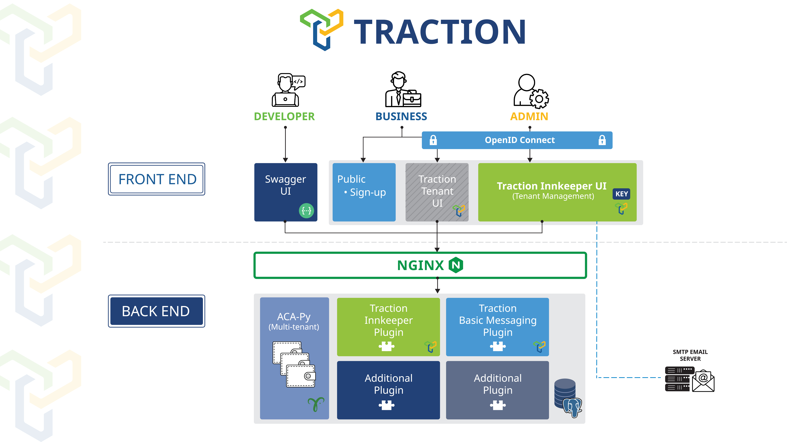

# Traction


[](LICENSE) [](<Redirect-URL>) [](https://codeclimate.com/github/bcgov/traction/maintainability)


## Table of Contents

- [What is Traction?](#what-is-traction)
- [Start using Traction](#start-using-traction)
- [What are the benefits of using Traction?](#what-are-the-benefits-of-using-traction)
- [What is Traction comprised of?](#what-is-traction-comprised-of)
- [Start contributing to Traction](#start-contributing-to-traction)
- [Who is maintaining Traction?](#who-is-maintaining-traction)
- [How is Traction licenced?](#how-is-traction-licensed)
- [Engage with the community](#engage-with-the-community)


## What is Traction?

Traction is a digital wallet solution comprised of plugins layered on top of OpenWallet Foundation ACA-Py and streamlines the process of sending and receiving digital credentials for governments and organizations.

Its open-source foundation makes it easy to integrate digital trust technology into existing lines of business applications, without having to stand up, maintain and manage an instance of ACA-Py themselves. Future functionality could include machine-readable governance and more.



## Play in the Traction Sandbox

Establish your own Traction tenant in a B.C. Government sandbox to issue, hold, present, and verify digital credentials using these [setup instructions](./docs/traction-anoncreds-workshop.md).

**Disclaimer**: On the 1st and 15th of each month, the entire sandbox gets reset and all your work will be gone.

## Start using Traction

**Running Traction**: to run a local instance of traction, see the documentation in [scripts](./scripts/README.md).

**Deploying Traction**: Helm charts for deploying Traction to Kubernetes: [charts](./charts/README.md).


## What are the benefits of using Traction?

Traction makes it easier to integrate digital trust technology into existing line of business applications.

- **API-first Architecture**: Traction is designed with an API-first architecture, this RESTful API allows for integration into existing line-of-business applications already being used by organizations, the Tenant user interface is built on this API to enable adoption prior to integration and for low-use functions.
- **Enhanced Interoperability**: OWF ACA-Py makes Traction more broadly compatible with existing technologies used by governments and organizations around the world.
- **Multi-tenancy**: Rather than having multiple digital tools to integrate with organizations, one scalable instance of Traction can be used to participate in the digital trust ecosystem, control all connections, and more easily share data.
- **Higher Scalability**: Traction is open-source technology, encouraging collaborative refinement, faster release, and higher scalability.


## What is Traction comprised of?

- [ACA-Py + plugins](./plugins/README.md)
- [Tenant UI](./services/tenant-ui/README.md)


## Start contributing to Traction

Traction is an open-source technology project that welcomes collaboration.

If you would like to contribute to Traction, please review the following:

- [Contributing](./CONTRIBUTING.md)
- [Code of Conduct](./CODE_OF_CONDUCT.md)
- [Compliance](./COMPLIANCE.yaml)


## Developers: devcontainers
To aid in developers, there are 2 `devcontainers`: [plugins](./plugins/.devcontainer/devcontainer.json) and [tenant-ui](./services/tenant-ui/.devcontainer/devcontainer.json).

The devcontainers and associated vscode launch files are for convenience only, they are not mandatory for developing and debugging. Please feel free to develop anyway you choose.

1. In VS code, open `plugins`.
2. Follow all prompts to open the devcontainer.
3. In a second VS Code window, open `services/tenant-ui`
4. Follow all prompts to open the devcontainer.
5. in `plugins`, start up the ACA-Py / Traction instance: Run and Debug view, "Run/Debug Plugin", start/F5
6. in `services/tenant-ui`, start up the backend api: Run and Debug view, "backend - run dev", start/F5
7. in `services/tenant-ui`, start up the frontend api: Run and Debug view, "frontend - run dev", start/F5
8. in `services/tenant-ui`, load a Chrome browser for debugging frontend: Run and Debug view, "frontend - chrome", start/F5

If all starts up without a hitch, then you should be able to breakpoint the tenant-ui frontend (Vue/Chrome), tenant-ui backend api (Node.js) and traction plugins (Python) for local debugging.

Out of the box, the above will use the following ports:

- ACA-Py/Traction Plugins: 3000, 3001 (admin)
- Tenant Proxy: 8032
- Traction DB: 5432
- Tenant UI backend server: 8080
- Tenant UI frontend server: 5173

Note that Tenant Proxy and Traction DB are started via docker compose when starting ACA-Py/Traction Plugins

### Repository workflow
Currently authorized users can create a branch and run a pull request to merge in changes. Unauthorized can always create a fork.

#### Rebasing of a branch
```bash
git fetch --all
git pull

git rebase origin/main
git push --force
```

## How is Traction licensed?

Traction is licensed under Apache License 2.0 which can be reviewed [here](./LICENSE).


## Engage with the community

Connect with others
- for ACA-Py discussion see the OWF ACA-Py Github [for links to discussion forums](https://github.com/openwallet-foundation/acapy?tab=readme-ov-file#troubleshooting)
