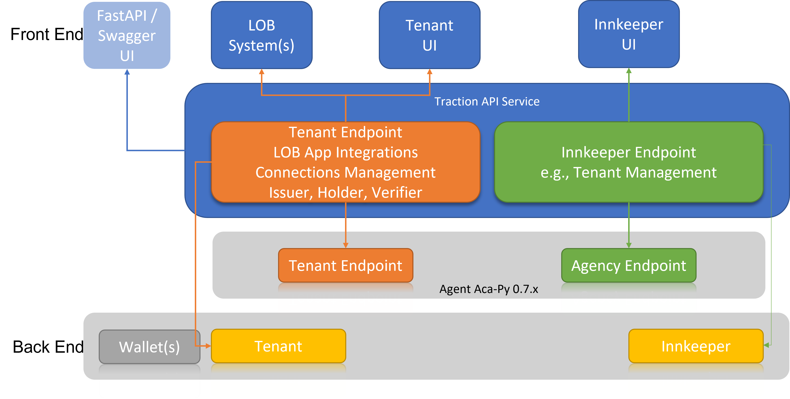

# traction architecture

Traction provides a service layer to manage Aries agent instances in a multi-tenant aca-py deployment, and provides some value-add services for using aca-py functions such as setting up issuer agents, and issuing and verifying credentials.  Future functionality could include machine-readable governance, etc.

Traction is built using open-source frameworks such as [FastAPI](https://fastapi.tiangolo.com/) to build and manage web services, [sqlalchemy](https://www.sqlalchemy.org/) to manage database access and [pydantic](https://pydantic-docs.helpmanual.io/) to support data validation.

## Architecture Overview

The below picture shows the main traction components:



- Aca-py agent - Aca-py provides a multi-tenant Aries agent that allows a manager (called an "Innkeeper") to create and manage Aries agents ("tenants") for different line-of-business ("LOB") applications.  Each tenant agent is secure and independant, managed by the business owner, and controlled (via traction) by the owner's LOB application.
- Back End - traction maintains a database for the Innkeeper and for each tenant to store value-add information, augmenting the information stored by Aca-py.  Traction stores information about connected agents, tenant status (such as whether they are an issuer), any inflight or workflows (such as issued credential) to simplify LOB integration with Aries agents and protocols.
- Traction Service - A set of secure web services that the Innkeeper and tenants use to interact with their Aca-py agent, and with other connected agents using Aries protocols.  Traction provides a separate set of services for Innkeepers and tenants (each set of services is secured for the appropriate users), as well as providing "wrapper" (secure) access to Aca-py functions that are outside of traction's scope (such as simple ledger lookups).
- Front End - Traction provides a swagger interface for each set of services, to allow developers or evaluators to interact with traction in a simple, browser-based manner.  Traction also provides a demonstration "Showcase" application to illustrate how a set of Aries users can interact using traction agents.

## Communication between Traction and LOB

Traction provides a set of web services that the tenant LOB can call.  Traction also provides web hooks to which can notify the tenant LOB of any events which the LOB needs to respond to (or, for example, the completion of workflows that the LOB is dependant on).  The tenant can provide a custom endpoint for their LOB (the LOB needs to expose a web service that traction can call) and can subscribe to events of interest.  Traction can forward web hooks received from aca-py, and can provides web hooks for higher-level "business" events.  It is expected that an LOB will typically subscribe to the traction "business" events, but may be interested in a sub-set of the aca-py web hooks.

## Security

Front end applications have to authenticate to be able to call traction services.

For the innkeeper, traction (currently) supports a single ID and password (this will likely change in a future version) - the front end app has to call a `/token` endpoint to retrieve a JWT, and then must provide the JWT for each service call.  For a tenant, they have to provide their wallet_id and wallet_key to a `/token` endpoint to get a JWT (specific to their wallet) which they have to provide with each service call.  (Note that the tenant is expected to store their wallet_id and wallet_key, there is no way to retrieve the wallet_key once their tenant wallet has been created.)

Web hook callbacks form traction to the tenant's LOB application are secured using an API key (provided by the tenant).

Service calls between traction and aca-py are secured by API keys (one for calls to aca-py and one for webhook callbacks from aca-py to traction) and - for tenant wallets - the tenant's bearer token (derived from their JWT).  (This security model is defined by aca-py.)

The tenant's wallet is encrypted using their wallet_key (implemented by indy-sdk or aries-askar, depending on the aca-py configuration).

## Traction code structure

Traction code is organized using the following structure:

```
/services/traction
   |
   |-----> acapy_client   - service and model classes for calling aca-py
   |
   |-----> acapy_wrapper  - "wrapper" services to allow tenants to access aca-py directly (using traction's integrated security)
   |
   |-----> api
   |    |
   |    |-----> core      - core utility classes
   |    |
   |    |-----> db        - database model and accessor classes ("repositories")
   |    |
   |    |-----> endpoints - traction service endpoints and dependencies (models, etc)
   |    |
   |    |-----> services  - common services (typically used by multiple endpoints)
   |
   |-----> tests          - unit and integration tests
```

In general the dependencies are from `endpoints -> services -> db`, and `core` classes are used everywhere.

See the [traction developer](../services/traction/README.md) documents for details on implementing each component.
