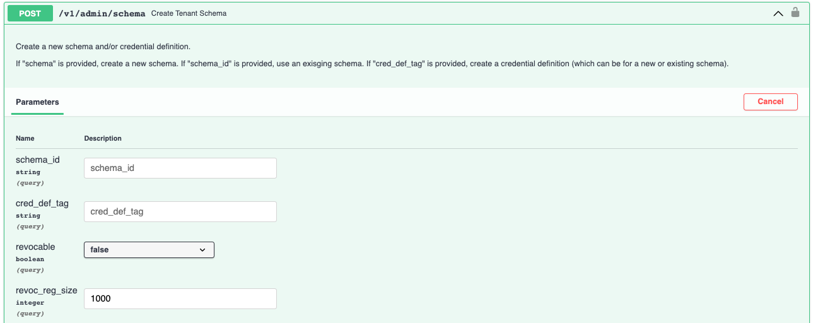
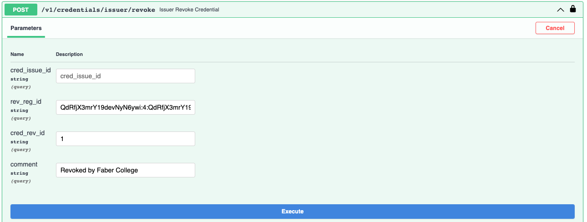

# Running the traction demo

## Running traction using swagger

Start up the traction services as follows - open up a bash shell and run the following:

```bash
git clone https://github.com/bcgov.traction.git
cd traction/scripts
cp .env-example .env
docker-compose build
docker-compose up
```

### Setting up a new Issuer tenant

- As innkeeper, authenticate with the swagger interface
- As innkeeper, create a new tenant
- As innkeeper, make the tenant an issuer
- As tenant, authenticate with the swagger interface
- As tenant, complete the issuer update

[Watch it here!](./assets/traction-new-tenant-issuer.mp4)

### Adding a new Schema/Credential Definition for an Issuer

- As tenant, create a schema and credential definition

[Watch it here!](./assets/traction-issuer-create-schema.mp4)

To create a credential definition for revocable credentials, you need to supply the following two parameters when creating the credential definition:

- `revocable` - set to true
- `revoc_reg_size` - this is the number of credentials per revocation registry

<details>
    <summary>Show me a screenshot!</summary>
    
</details>

Aca-py will create two revocation registries when the credential definition is created (one active and one spare) - once the revocation registry is "full" (each time a credential is issued it takes one spot in the registry), Aca-py will automatically make the spare registry active, and will then create a new spare (so there will always be a spare registry available).

The size of the registry is a trade-off - the larger the registry the less often a new registry will need to be created, however revocation registries tend to be very large and take a long time to create, so there is a practical maximum size.  Also, some mobile agents will download the registry, and can only deal with files up to a certain size.

A revocation registry has a maximum size. The size should be at least 4, and max 32768. Creating a revocation registry with the maximum size results in a tails file of over 8MB.  There are some metrics [here](https://github.com/bcgov/indy-tails-server#metrics-about-tails-files)

### Connect two tenants

- As innkeeper, create a second tenant
- As the second tenant, authenticate with the swagger interface
- As first tenant, create a connection invitation
- As second tenant, accept the connection invitation

[Watch it here!](./assets/traction-connect-two-tenants.mp4)

### Issue (and Accept) a Credential

- As first tenant, issue a credential (create an offer)
- As second tenant, accept the credential offer
- As second tenant, view the received credential

[Watch it here!](./assets/traction-issue-credential.mp4)

Note that there is nothing special the issuer needs to do to issue a revocable credential, this is handled automatically by traction and Aca-py.

A revocable credential generates two additional attributes that are required to later revoke the credential:

- `rev_reg_id` - the revocation registry identifier - this can be looked up on the ledger to locate/download the registry
- `cred_rev_id` - the index of the credential within the registry

<details>
    <summary>Show me a screenshot!</summary>
    
</details>

To revoke the credential, you can provide these two values, *or* you can provide the `id` of the credential issue record.

<details>
    <summary>Show me a screenshot!</summary>
    
</details>

The `comment` is sent to the holder with the revocation notification, and can provide some context for why the credential was revoked.

### Request (and Provide) a Credential Presentation

- As first tenant, create and send a presentation request
- As second tenant, determine which credentials to present
- As second tenant, present the selected credentials
- As first tenant, cerify the provided presentation

[Watch it here!](./assets/traction-presentation-request.mp4)

To include proof of non-revocation, include the `non_revoked` attribute with a timestamp.  (You can specify `from` and `to`, for a revocation range, but typically only the `to` timestamp is provided.)  See the [integration tests](https://github.com/bcgov/traction/blob/develop/services/traction/tests/integration/endpoints/routes/test_tenant_revocation.py) for examples of non-revocation proofs.

