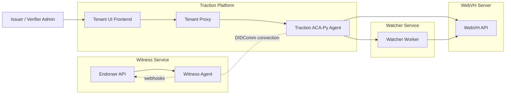
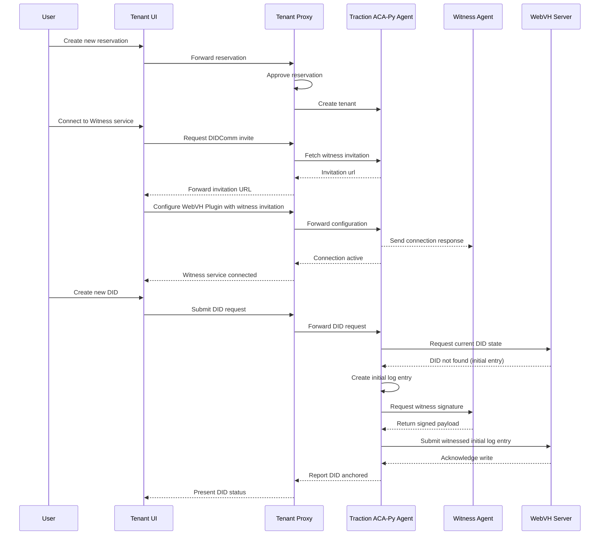

# Traction WebVH Deployment

## Overview
Traction uses an ACA-Py agent with Traction-specific plugins to publish and resolve decentralized identifiers. When the `webvh` plugin is enabled, the agent integrates with a Web Verified History (WebVH) service so that DID documents are written to, and read from, a tamper-evident log. The diagram below captures the components involved in a typical deployment and how they communicate.

## Component Diagram

## Interaction Highlights
- Tenant administrators work in the Tenant UI, which forwards administrative API calls through the Tenant Proxy to the Traction ACA-Py agent.
- ACA-Py coordinates WebVH DID operations using the `webvh` plugin. When a DID update is prepared, ACA-Py waits for the Witness Service to supply co-signatures via their existing DIDComm connection.
- Witness operators (or automated jobs) interact with the Endorser API to trigger the Witness Agent. The Witness Agent posts webhook callbacks to the Endorser API and shares signed payload details with ACA-Py over the DIDComm channel.
- After collecting the necessary witness signatures, only the Traction ACA-Py agent submits the finalized payload to the WebVH server; there is no callback path from WebVH back to Traction.
- The Witness Agent maintains a DIDComm connection with the Traction ACA-Py agent, allowing event notifications and co-signing responses to flow asynchronously.
- WebVH anchoring details surface to the Tenant UI via the data that ACA-Py aggregates from witness signatures and submission results; WebVH itself does not call back into Traction.

## Sequence Diagram

